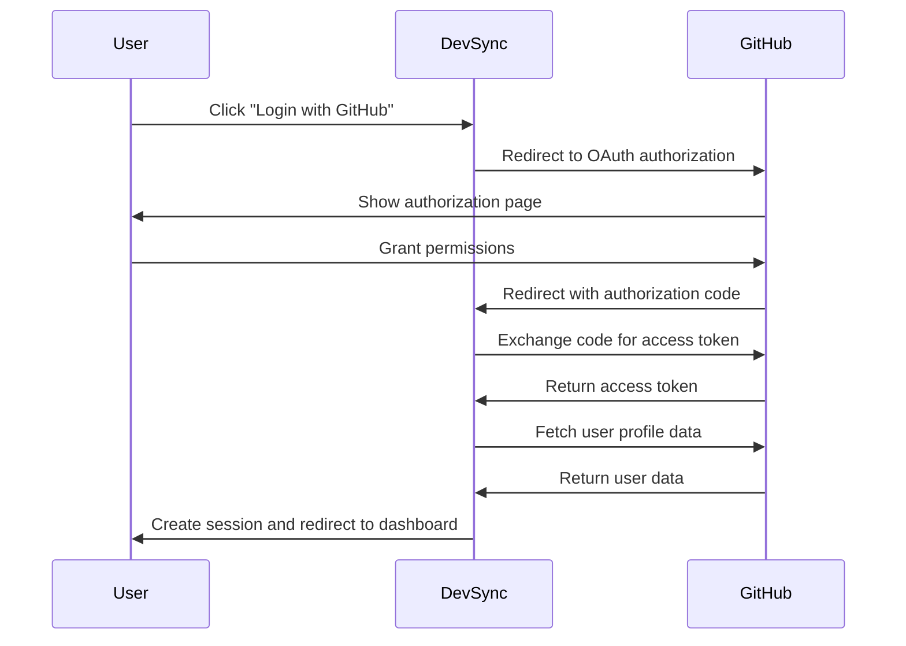

# GitHub Integration Documentation

## 🔗 GitHub Integration Overview

DevSync's GitHub integration is the cornerstone of the platform, providing seamless authentication, contribution tracking, and repository management. The integration uses GitHub's OAuth2 flow for authentication and the GitHub API for data synchronization.

## 🏗️ Integration Architecture

```
DevSync Platform
├── GitHub OAuth2 Authentication
│   ├── Login Flow
│   ├── User Profile Sync
│   └── Session Management
├── GitHub API Integration
│   ├── Repository Validation
│   ├── Contribution Tracking
│   └── User Data Fetching
└── Webhook Integration (Future)
    ├── Real-time PR Updates
    └── Automatic Point Attribution
```

## 🔐 Authentication Flow

### 1. OAuth2 Implementation

DevSync uses GitHub's OAuth2 flow for secure user authentication:

```javascript
// GitHub Strategy Configuration
passport.use(new GitHubStrategy({
  clientID: process.env.GITHUB_CLIENT_ID,
  clientSecret: process.env.GITHUB_CLIENT_SECRET,
  callbackURL: process.env.GITHUB_CALLBACK_URL,
  scope: ["user", "user:email"]
}, async (accessToken, refreshToken, profile, done) => {
  // User authentication and profile creation logic
}));
```

### 2. Authentication Sequence



### 3. Scope Permissions

DevSync requests the following GitHub scopes:

- **`user`**: Read access to user profile information
- **`user:email`**: Access to user's email addresses (including private)

### 4. User Profile Synchronization

```javascript
async function syncUserProfile(accessToken, profile) {
  const userOctokit = new Octokit({ auth: accessToken });
  
  // Fetch user emails
  const { data: emails } = await userOctokit.rest.users.listEmailsForAuthenticatedUser();
  const primaryEmail = emails.find(email => email.primary)?.email;
  
  // Create or update user profile
  let user = await User.findOne({ githubId: profile.id });
  
  if (!user) {
    user = await User.create({
      githubId: profile.id,
      username: profile.username,
      displayName: profile.displayName,
      email: primaryEmail,
      avatarUrl: profile.photos[0]?.value,
      joinedAt: new Date()
    });
    
    // Send welcome email for new users
    await emailService.sendWelcomeEmail(primaryEmail, profile.username);
  } else {
    // Update existing user data
    await User.findByIdAndUpdate(user._id, {
      username: profile.username,
      displayName: profile.displayName,
      email: primaryEmail,
      avatarUrl: profile.photos[0]?.value
    });
  }
  
  return user;
}
```

## 🔧 GitHub API Integration

### 1. Octokit Configuration

DevSync uses the Octokit library for GitHub API interactions:

```javascript
// config/octokit.js
const { Octokit } = require("@octokit/rest");

// Server-side Octokit instance (for admin operations)
const octokit = new Octokit({
  auth: process.env.GITHUB_ACCESS_TOKEN,
  userAgent: 'DevSync/1.0.0'
});

// User-specific Octokit instance (created per user)
function createUserOctokit(userAccessToken) {
  return new Octokit({
    auth: userAccessToken,
    userAgent: 'DevSync/1.0.0'
  });
}

module.exports = { octokit, createUserOctokit };
```

### 2. Repository Validation

When users submit repositories, DevSync validates them through the GitHub API:

```javascript
async function validateGitHubRepository(repoUrl) {
  try {
    // Parse repository URL
    const match = repoUrl.match(/github\.com\/([^\/]+)\/([^\/]+)/);
    if (!match) {
      throw new Error('Invalid GitHub URL format');
    }
    
    const [, owner, repo] = match;
    
    // Check repository exists and is accessible
    const { data: repository } = await octokit.rest.repos.get({
      owner,
      repo: repo.replace(/\.git$/, '')
    });
    
    // Validate repository properties
    if (repository.private && !repository.permissions?.admin) {
      throw new Error('Cannot access private repository');
    }
    
    if (repository.archived) {
      throw new Error('Repository is archived');
    }
    
    return {
      valid: true,
      repository: {
        id: repository.id,
        fullName: repository.full_name,
        description: repository.description,
        language: repository.language,
        stargazersCount: repository.stargazers_count,
        forksCount: repository.forks_count,
        openIssuesCount: repository.open_issues_count
      }
    };
  } catch (error) {
    return {
      valid: false,
      error: error.message
    };
  }
}
```

### 3. Contribution Tracking

DevSync tracks user contributions across registered repositories:

```javascript
async function getUserContributions(username, repositoryUrls) {
  try {
    const contributions = [];
    
    for (const repoUrl of repositoryUrls) {
      const [, owner, repo] = repoUrl.match(/github\.com\/([^\/]+)\/([^\/]+)/);
      
      // Fetch pull requests by user
      const { data: pullRequests } = await octokit.rest.pulls.list({
        owner,
        repo: repo.replace(/\.git$/, ''),
        creator: username,
        state: 'all',
        per_page: 100
      });
      
      // Filter merged PRs and extract relevant data
      const mergedPRs = pullRequests
        .filter(pr => pr.merged_at)
        .map(pr => ({
          id: pr.id,
          number: pr.number,
          title: pr.title,
          repository: `${owner}/${repo}`,
          mergedAt: pr.merged_at,
          additions: pr.additions,
          deletions: pr.deletions,
          changedFiles: pr.changed_files,
          url: pr.html_url
        }));
      
      contributions.push(...mergedPRs);
    }
    
    return contributions.sort((a, b) => new Date(b.mergedAt) - new Date(a.mergedAt));
  } catch (error) {
    console.error('Error fetching contributions:', error);
    return [];
  }
}
```

### 4. User Statistics Fetching

```javascript
async function getGitHubUserStats(username) {
  try {
    // Get user profile
    const { data: user } = await octokit.rest.users.getByUsername({
      username
    });
    
    // Get user repositories
    const { data: repositories } = await octokit.rest.repos.listForUser({
      username,
      type: 'owner',
      sort: 'updated',
      per_page: 100
    });
    
    // Calculate statistics
    const stats = {
      profile: {
        login: user.login,
        name: user.name,
        bio: user.bio,
        location: user.location,
        company: user.company,
        blog: user.blog,
        publicRepos: user.public_repos,
        publicGists: user.public_gists,
        followers: user.followers,
        following: user.following,
        createdAt: user.created_at
      },
      repositories: {
        total: repositories.length,
        languages: {},
        totalStars: 0,
        totalForks: 0
      }
    };
    
    // Process repository data
    repositories.forEach(repo => {
      if (repo.language) {
        stats.repositories.languages[repo.language] = 
          (stats.repositories.languages[repo.language] || 0) + 1;
      }
      stats.repositories.totalStars += repo.stargazers_count;
      stats.repositories.totalForks += repo.forks_count;
    });
    
    return stats;
  } catch (error) {
    console.error('Error fetching GitHub stats:', error);
    return null;
  }
}
```

## 🎯 Point Calculation System

### 1. Contribution Value Assessment

DevSync calculates points based on various contribution factors:

```javascript
async function calculateContributionPoints(pullRequest, repository) {
  let basePoints = 50; // Default base points
  
  // Repository-specific points (set by maintainer)
  const repo = await Repo.findOne({ repoLink: repository.url });
  if (repo) {
    basePoints = repo.successPoints || 50;
  }
  
  // Size-based multiplier
  const sizeMultiplier = calculateSizeMultiplier(pullRequest);
  
  // Complexity multiplier (based on files changed, additions/deletions)
  const complexityMultiplier = calculateComplexityMultiplier(pullRequest);
  
  // Repository popularity bonus
  const popularityBonus = calculatePopularityBonus(repository);
  
  const finalPoints = Math.round(
    basePoints * sizeMultiplier * complexityMultiplier + popularityBonus
  );
  
  return Math.min(finalPoints, 1000); // Cap at 1000 points
}

function calculateSizeMultiplier(pullRequest) {
  const { additions, deletions } = pullRequest;
  const totalChanges = additions + deletions;
  
  if (totalChanges < 10) return 0.8;
  if (totalChanges < 50) return 1.0;
  if (totalChanges < 200) return 1.2;
  if (totalChanges < 500) return 1.5;
  return 2.0;
}

function calculateComplexityMultiplier(pullRequest) {
  const { changedFiles } = pullRequest;
  
  if (changedFiles === 1) return 1.0;
  if (changedFiles <= 3) return 1.1;
  if (changedFiles <= 5) return 1.2;
  if (changedFiles <= 10) return 1.3;
  return 1.5;
}

function calculatePopularityBonus(repository) {
  const { stargazersCount } = repository;
  
  if (stargazersCount < 10) return 0;
  if (stargazersCount < 100) return 5;
  if (stargazersCount < 1000) return 10;
  if (stargazersCount < 5000) return 15;
  return 20;
}
```

### 2. Badge Assignment Logic

```javascript
async function assignBadgesBasedOnContributions(user) {
  const badges = new Set(['Newcomer']);
  const mergedPRCount = user.mergedPRs.length;
  const totalPoints = user.points;
  
  // Contribution milestone badges
  if (mergedPRCount >= 1) badges.add('First Contribution');
  if (mergedPRCount >= 5) badges.add('Active Contributor');
  if (mergedPRCount >= 10) badges.add('Super Contributor');
  if (mergedPRCount >= 25) badges.add('Elite Contributor');
  if (mergedPRCount >= 50) badges.add('Master Contributor');
  
  // Point-based level badges
  const levelBadges = [
    { threshold: 0, badge: 'Cursed Newbie | Just awakened.....' },
    { threshold: 100, badge: 'Graveyard Shifter | Lost but curious' },
    { threshold: 250, badge: 'Night Stalker | Shadows are friends' },
    { threshold: 500, badge: 'Skeleton of Structure | Casts magic on code' },
    { threshold: 1000, badge: 'Phantom Architect | Builds from beyond' },
    { threshold: 2000, badge: 'Haunted Debugger | Haunting every broken line' },
    { threshold: 3500, badge: 'Lord of Shadows | Master of the unseen' },
    { threshold: 5000, badge: 'Dark Sorcerer | Controls the dark arts' },
    { threshold: 7500, badge: 'Demon Crafter | Shapes the cursed world' },
    { threshold: 10000, badge: 'Eternal Revenge | Undying ghost' }
  ];
  
  levelBadges.forEach(({ threshold, badge }) => {
    if (totalPoints >= threshold) {
      badges.add(badge);
    }
  });
  
  // Special achievement badges
  await assignSpecialBadges(user, badges);
  
  return Array.from(badges);
}

async function assignSpecialBadges(user, badges) {
  // Check for language diversity
  const languages = await getContributionLanguages(user.githubId);
  if (languages.length >= 3) badges.add('Polyglot Contributor');
  if (languages.length >= 5) badges.add('Language Master');
  
  // Check for contribution frequency
  const recentContributions = user.mergedPRs.filter(pr => 
    new Date(pr.mergedAt) > new Date(Date.now() - 30 * 24 * 60 * 60 * 1000)
  );
  if (recentContributions.length >= 5) badges.add('Active This Month');
  
  // Check for high-value contributions
  const highValuePRs = user.mergedPRs.filter(pr => pr.points >= 100);
  if (highValuePRs.length >= 3) badges.add('Quality Contributor');
}
```

## 🔄 Data Synchronization

### 1. Manual Sync Endpoint

Users can manually trigger synchronization of their GitHub data:

```javascript
router.post('/api/github/sync', isAuthenticated, async (req, res) => {
  try {
    const user = req.user;
    
    // Fetch latest contributions
    const registeredRepos = await Repo.find({ reviewStatus: 'accepted' });
    const repoUrls = registeredRepos.map(repo => repo.repoLink);
    
    const contributions = await getUserContributions(user.username, repoUrls);
    
    // Update user's merged PRs
    const newMergedPRs = contributions.map(pr => ({
      repoId: pr.repository,
      prNumber: pr.number,
      title: pr.title,
      mergedAt: new Date(pr.mergedAt)
    }));
    
    // Calculate new points and badges
    const newPoints = await calculatePoints(newMergedPRs, user.githubId);
    const newBadges = await assignBadgesBasedOnContributions({
      ...user.toObject(),
      mergedPRs: newMergedPRs,
      points: newPoints
    });
    
    // Update user record
    await User.findByIdAndUpdate(user._id, {
      mergedPRs: newMergedPRs,
      points: newPoints,
      badges: newBadges
    });
    
    res.json({
      success: true,
      contributions: newMergedPRs.length,
      points: newPoints,
      badges: newBadges
    });
  } catch (error) {
    console.error('Sync error:', error);
    res.status(500).json({ error: 'Synchronization failed' });
  }
});
```

### 2. Automated Background Sync

```javascript
// Background job for periodic synchronization
const cron = require('node-cron');

// Run every 6 hours
cron.schedule('0 */6 * * *', async () => {
  try {
    console.log('Starting background GitHub sync...');
    
    const users = await User.find({ 
      joinedAt: { $gte: new Date(Date.now() - 30 * 24 * 60 * 60 * 1000) } 
    });
    
    for (const user of users) {
      await syncUserContributions(user);
      
      // Rate limiting - wait 1 second between users
      await new Promise(resolve => setTimeout(resolve, 1000));
    }
    
    console.log(`Background sync completed for ${users.length} users`);
  } catch (error) {
    console.error('Background sync error:', error);
  }
});
```

## 🔮 Future Enhancements

### 1. Webhook Integration

Real-time updates via GitHub webhooks:

```javascript
// Planned webhook handler
router.post('/api/github/webhook', async (req, res) => {
  const event = req.headers['x-github-event'];
  const payload = req.body;
  
  switch (event) {
    case 'pull_request':
      if (payload.action === 'closed' && payload.pull_request.merged) {
        await handlePRMerged(payload);
      }
      break;
    
    case 'push':
      await handlePushEvent(payload);
      break;
    
    default:
      console.log(`Unhandled webhook event: ${event}`);
  }
  
  res.status(200).send('OK');
});
```

### 2. Advanced Analytics

Enhanced contribution analytics:

```javascript
async function getAdvancedUserAnalytics(username) {
  // Contribution timeline
  // Language usage trends
  // Repository impact metrics
  // Collaboration patterns
  // Code review participation
}
```

### 3. Team Features

Organization and team management:

```javascript
async function getOrganizationStats(orgName) {
  // Organization contribution summary
  // Team leaderboards
  // Project coordination
  // Bulk user management
}
```

## 🛠️ Troubleshooting GitHub Integration

### Common Issues

1. **Rate Limiting**: GitHub API has rate limits
   - Solution: Implement proper rate limiting and caching
   - Use authenticated requests for higher limits

2. **Repository Access**: Private repository access issues
   - Solution: Check user permissions and OAuth scopes

3. **Stale Data**: Outdated contribution information
   - Solution: Implement regular sync schedules

4. **API Token Expiration**: Access tokens may expire
   - Solution: Implement token refresh mechanism

This documentation provides a comprehensive guide to DevSync's GitHub integration, enabling developers to understand, maintain, and extend the GitHub connectivity features.
